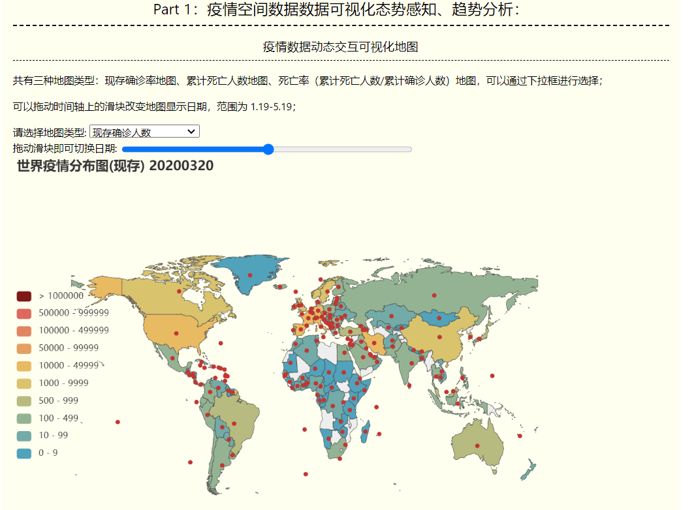
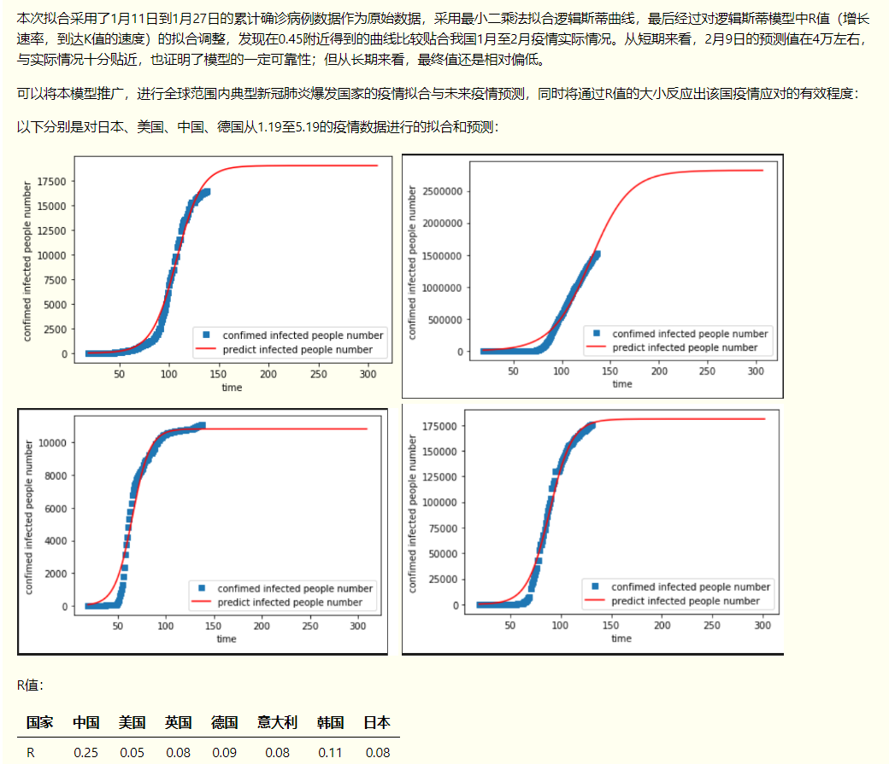
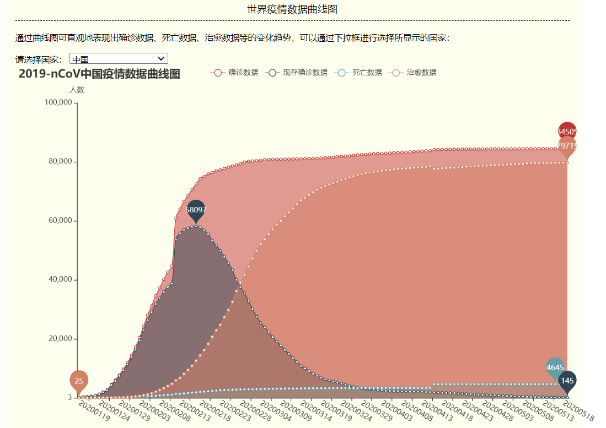
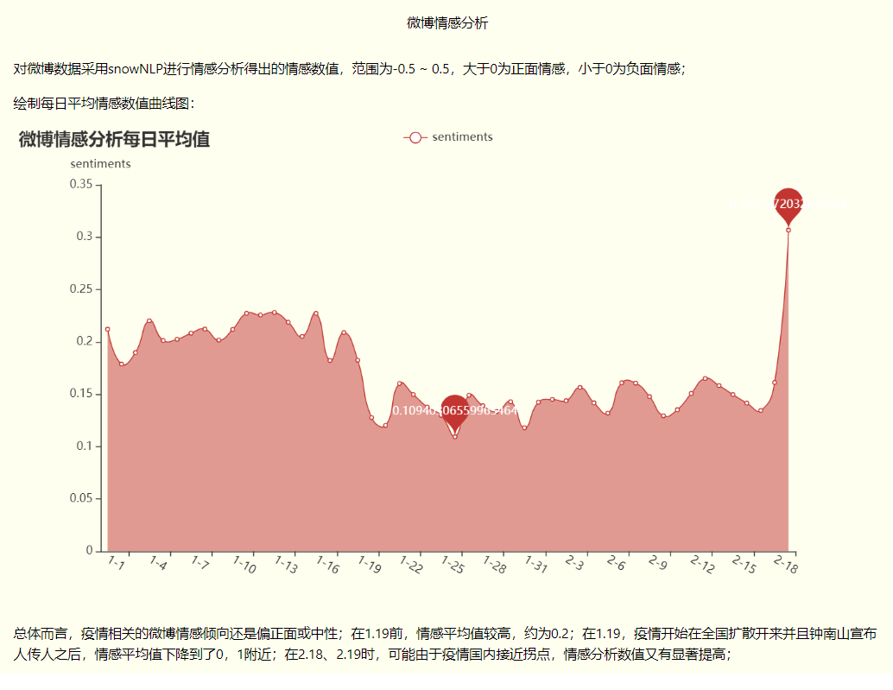
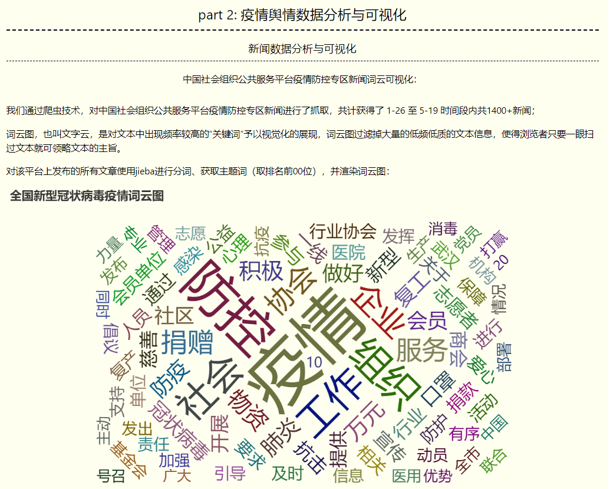

# 疫情预测与舆情分析

该项目是浙江大学地理空间数据库课程作业8：空间分析中，使用 flask + pyechart 搭建的简单新冠肺炎疫情数据可视化交互分析平台，包含疫情数据获取、态势感知、预测分析、舆情监测等任务

项目分析报告已部署到网页端，可点击[http://flask.yunwei123.tech/](http://flask.yunwei123.tech/)进行查看

交互可视化分析报告截图：

## 空间数据分析 作业要求

### 作业目的：

了解空间数据在日常生活中的应用，熟悉空间数据统计分析、空间数据挖掘、空间数据可视化等技术。

### 作业内容：

新型冠状病毒肺炎（COVID-19，简称“新冠肺炎”）疫情肆虐全球多个国家，2020年3月11日，世界卫生组织 (WHO) 正式宣布将新冠肺炎列为全球性大流行病。在全球抗击新型冠状病毒疫情的过程中，产生了前所未有的大规模疫情数据，利用大数据分析技术和方法能够协助发现病毒传染源、监测疫情发展、调配救援物资，从而更好地进行疫情防控工作。空间数据分析作为大数据分析的重要组成，将数据智能处理、直观展示和交互分析有机地结合，使机器智能和人类智慧深度融合、优势互补，为疫情防控中的分析、指挥和决策提供有效依据和指南。

作业要求以新冠疫情或其它重大公共卫生事件的相关时空数据为基础，利用数据清洗与管理、统计分析、数据挖掘、数据可视化等相关技术和方法，探索并发现疫情大数据背后隐藏的模式和规律。请选择一个具体的研究题目，进行深入分析。

### 选题：疫情预测与舆情监测：

本项目希望能利用交互式空间数据分析技术，感知和预测疫情发展趋势与关键节点、分析社交媒体话题与情感的动态演变、对社会舆情进行态势感知。

## 文档与目录结构

- dataSets
  - china_provincedata.csv 中国各省、直辖市、自治区、特别行政区的疫情数据
  - countrydata.csv 全球214个国家地区以及钻石公主号邮轮的疫情数据 
  - nCoV_900k_train.unlabled.csv 
    >数据集依据与“新冠肺炎”相关的230个主题关键词进行数据采集，抓取了2020年1月1日—2020年2月20日期间共计100万条微博数据，并对其中10万条数据进行人工标注，标注分为三类，分别为：1（积极），0（中性）和-1（消极）。

  - nCoV_100k_train.labled.csv 同上，有标注
    >数据集太大了就先不上传了

  - nCov_10k_test.csv 同上
  - yqkx_data-5_21.csv 使用爬虫获取的人民网疫情快讯新闻100篇
  - 中国社会组织_疫情防控-5_21.csv 中国社会组织公共服务平台疫情防控专区新闻
  - weiboComments-5_21.csv 5.21微博《战疫情》主题下的微博和评论数据
- notebook 分析时使用的notebook
- scripts python脚本（爬虫、可视化、数据处理等等）
  - spider-yqkx.py 人民网爬虫
  - spider-社会组织.py 中国社会组织公共服务平台爬虫
  - weibo_战疫情爬虫_spider.py  微博《战疫情》爬虫
  - pyecharts-zhexian-country.py 使用pyecharts绘制任一国家疫情数据曲线图
  - hierachy.py 层次聚类分析代码
  - jiebafenci.py jieba分词代码及词云图渲染
  - lineCountry.py 生成疫情曲线图
  - logistic.py logistic分析代码
  - mapchina.py 生成中国疫情地图
  - mapworld.py 生成世界疫情地图
  - mergeweibo.py weiboprocess.py 微博数据处理工具
  - weiboAnalyse.py 微博数据分析代码
  - wordData.py weiboWordData.py 词云图保存数据
  - tfidf.py tfidf值可视化
  - sentiments.py 情感分析
- templates： 网站html/css/js及图片文件

## 作业部分相关技术栈

- 数据库的构建与sql语句查询
- pyEchart可视化
- postgres sql数据分析
- snownlp 情感分析
- jieba
- flask

## 运行：

1. 运行 server.py
2. 打开  http://127.0.0.1:5000/

